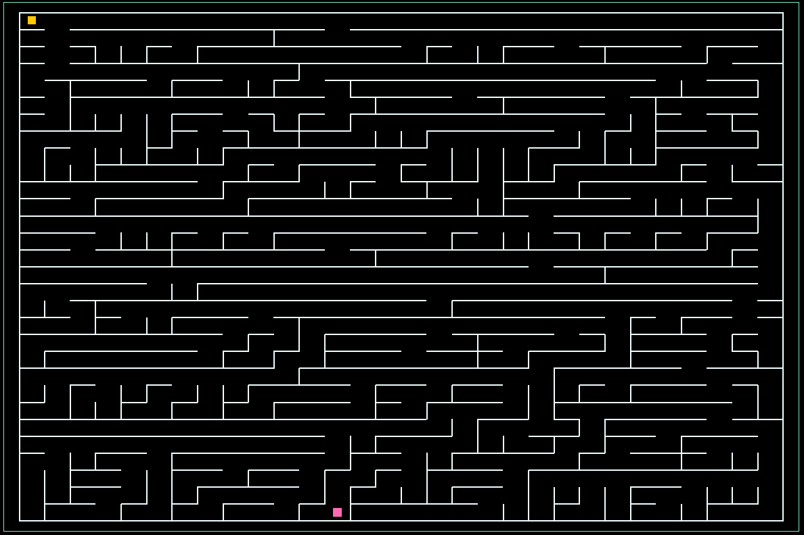

#
Labyrinth

---
## Table of contents

* [Description](#description)
* [Technologies](#technologies)
* [Project setup](#project-setup)
* [Future scope](#future-scope)
---
## Description

Simple Labyrinth game on Sidewinder Algorithm.
It creates random labyrinth size 30x30 cells.
To win you need get to the pink square.

---
## Technologies

Project is created with:
* pygame version: 2.1.2
---
## Project setup
npm install pythonprojectlabyrinth

---
## Future scope
* new algorithm of labyrinth
* menu to choose size of labyrinth
* timer